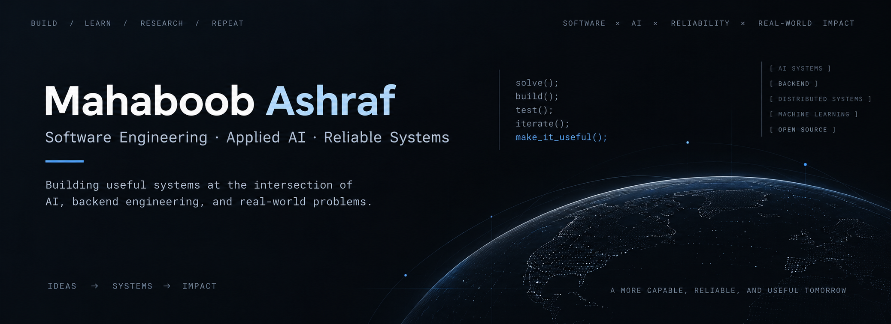

<p align="center">
  
</p>

<p align="center">
  <a href="mailto:mahaboobashraf12@gmail.com">Email</a>
  &nbsp;·&nbsp;
  <a href="https://www.linkedin.com/in/mohammad-mahaboob-ashraf-a0b17b321/">LinkedIn</a>
  &nbsp;·&nbsp;
  <a href="https://x.com/Mahaboob_Ashraf">X</a>
</p>

<p align="center">
  <strong>Building AI systems, backend infrastructure, and reliable software for real-world problems.</strong>
</p>

---

## About

I'm a Computer Science undergraduate focused on **Software Engineering, Applied AI, backend systems, and reliability**.

I’m especially interested in projects where the hard part is not just getting something to work once, but making it **correct, inspectable, failure-aware, and useful to real users**.

My work spans:

- AI systems with deterministic safety boundaries
- backend and reliability engineering
- developer tooling
- applied machine learning
- research
- data structures and algorithms

---

## Featured Projects

| Project | What it is | Stack | Highlight |
|---|---|---|---|
| **[Amana](https://github.com/Mahaboob-Ashraf/Agentic-Commerce-Gateway)** | Agentic commerce gateway that turns existing merchant systems into AI-transactable businesses and enables a safe AI buyer | Java · Spring Boot · Next.js · PostgreSQL · pgvector · Gemini · Razorpay | **250/250 deterministic safety cases passed** · fail-closed transaction authority |
| **[RepoPilot](https://github.com/Mahaboob-Ashraf/Repo-Pilot)** | Local-first coding-agent platform built to understand repositories before changing them | Python · FastAPI · tree-sitter · BM25 · Ollama | **Structure-aware repository retrieval** · local inference · human-in-the-loop architecture |
| **[HookRelay](https://github.com/Mahaboob-Ashraf/HookRelay)** | Reliable webhook delivery system built around explicit failure handling and recovery | TypeScript · Fastify · PostgreSQL · Redis · BullMQ | **Idempotency · retries · HMAC signing · DLQ · replay · at-least-once delivery** |
| **[VoteReady](https://github.com/Mahaboob-Ashraf/VoteReady)** | Citizen-first household navigator for India's SIR voter process | Next.js · TypeScript · Gemini · Supabase · PostgreSQL | **Multilingual record extraction · deterministic matching · human confirmation** |
| **[PS-Prep](https://github.com/Mahaboob-Ashraf/ps-prep)** | LeetCode-style programming-prep platform built for my college's Project School selection test | React · Vite · Supabase · Gemini · Monaco Editor | **~100+ student users** · improved from real user feedback |
| **[Skin Lesion Classification](https://github.com/Mahaboob-Ashraf/skin-lesion-classification)** | Error-driven HAM10000 skin-lesion classification study | PyTorch · TensorFlow · ResNet50 · Grad-CAM | **57.29% → 84.76% test accuracy** with class-imbalance-aware training |

---

## Project Notes

### Amana

**AI handles meaning. Deterministic software controls truth, authority, and money.**

Amana separates AI reasoning from financial authority.

The AI can understand intent, inspect merchant APIs, diagnose failures, and suggest mappings, while deterministic software owns the transaction path:

`proposal → authorization → execution → payment truth`

The system includes Razorpay Test Mode payments, webhook verification, reconciliation, bounded execution, fail-closed checks, and a deterministic adversarial safety proof.

---

### RepoPilot

RepoPilot is being built around the idea that a coding agent should **understand repository structure before attempting a patch**.

Currently implemented:

- repository discovery and ingestion
- Python structure-aware parsing
- semantic code chunks with source provenance
- lexical code retrieval
- local Ollama provider boundary
- automated parser, retrieval, pipeline, and API tests

Target direction:

```text
Repository + Issue
        ↓
Understand Structure
        ↓
Retrieve Evidence
        ↓
Plan
        ↓
Human Approval
        ↓
Patch
        ↓
Test
        ↓
Critique
```

The goal is an **inspectable engineering agent**, not an unrestricted autonomous coding bot.

---

### PS-Prep

PS-Prep started from a problem my classmates and I were actually facing.

Preparation material for our Project School selection test was scattered across old resources, coding environments, solutions, and chat tools, so I built a single platform for practice.

I shared it across multiple college classes during exam season, where it was used by roughly **100+ students**.

One of the first user-reported problems was that programs using `input()` had no convenient way to receive values. I added a dedicated stdin workflow based directly on that feedback.

**Build → ship → get feedback → fix the real problem.**

---

## Research

I'm involved in applied research across two domains:

### Computer Vision

Research work through **IIIT-H / iHub-Data**, involving computer-vision experimentation and evaluation.

### Computational Biology / Machine Learning

Research with **Drugparadigm** on bispecific-antibody manufacturability, involving large biological sequence datasets and constrained evaluation settings.

I'm particularly interested in ML problems involving:

`messy data` · `limited labels` · `domain constraints` · `evaluation uncertainty`

---

## Engineering Focus

<table>
<tr>
<td width="50%" valign="top">

### AI with boundaries

Models are useful for ambiguity, language, diagnosis, and planning.

Deterministic software should own irreversible authority and correctness-critical decisions.

</td>
<td width="50%" valign="top">

### Reliability before claims

Retries, idempotency, reconciliation, concurrency, and recovery belong in the system design from the beginning.

</td>
</tr>

<tr>
<td width="50%" valign="top">

### Evaluation over demos

I prefer measured behavior, failure analysis, tests, and reproducible evidence over a system that only worked once.

</td>
<td width="50%" valign="top">

### Real problems over feature lists

The projects I value most usually start with somebody genuinely needing the thing.

</td>
</tr>
</table>

---

## Core Stack

### Languages

`Java` · `C++` · `Python` · `TypeScript` · `JavaScript`

### Backend & APIs

`Spring Boot` · `FastAPI` · `Fastify`

### Databases & Data Systems

`PostgreSQL` · `Supabase` · `pgvector` · `Redis` · `BullMQ`

### AI / Machine Learning

`PyTorch` · `TensorFlow` · `Gemini` · `Ollama` · `tree-sitter`

### Frontend

`React` · `Next.js` · `Vite` · `Monaco Editor`

### Infrastructure & Tools

`Docker` · `Git` · `GitHub Actions`

---

## Currently

- building deeper **backend, AI-systems, and reliability** projects
- working on applied **ML research**
- practicing **DSA and competitive programming**
- preparing for **Software Engineering / Applied AI internships**

---

## Connect

[Email](mailto:mahaboobashraf12@gmail.com) ·
[LinkedIn](https://www.linkedin.com/in/mohammad-mahaboob-ashraf-a0b17b321/) ·
[X](https://x.com/Mahaboob_Ashraf)

I'm particularly interested in opportunities involving **AI systems, backend infrastructure, reliability, developer tooling, and applied machine learning**.
